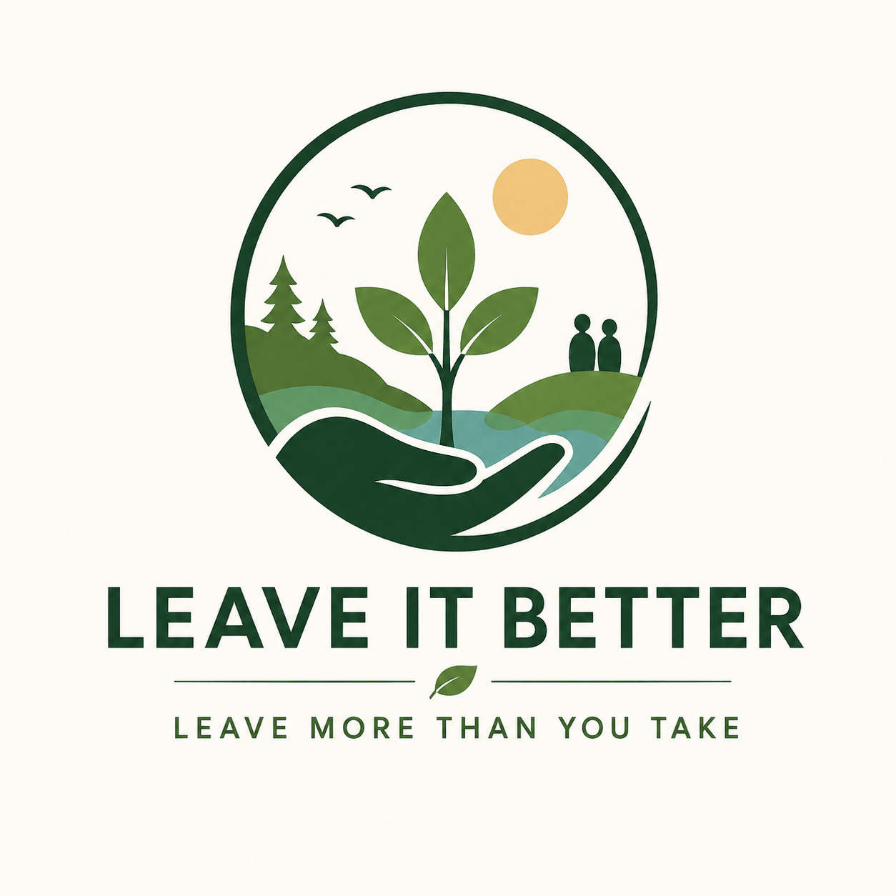

# Leave It Better
The home of **Leave It Better**: a long-term mission to create measurable positive impact for people, animals, plants and the planet.

  

<h1 align="center">Leave It Better</h1>

  <strong>Leave More Than You Take</strong>

Leave It Better is a long-term stewardship initiative focused on inspiring people to leave the world, their communities, ecosystems, and relationships better than they found them.

The project is currently in its foundational phase.

Over the coming months, we will define the mission, values, governance model, impact framework, and long-term vision before any public launch.

Our goal is simple:

Leave more than we take.
